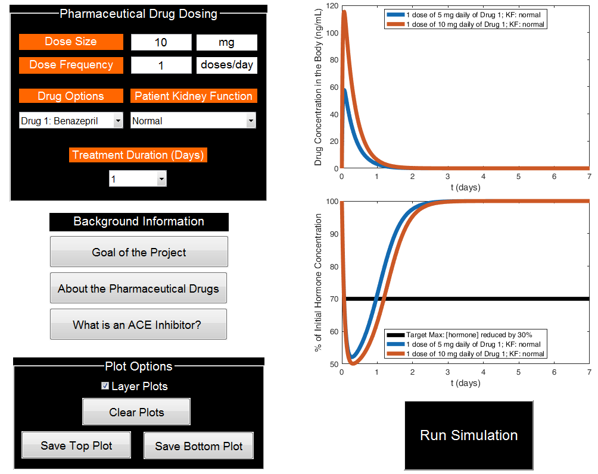

# Summary

This software features an MATLAB app install file and the source code for an interactive computer simulation packaged as a MATLAB app that can be used to design the best dosage of pharmaceuticals (ACE inhibitors) for reducing high blood pressure. The app uses concepts from chemical engineering and tools from mathematics, pharmacology, and computational science to describe and solve the dynamics of the chemical reactions in the human body involved in the absorption, metabolism, and excretion of the drug and how the blood pressure-regulating hormone angiotensin II is affected by the drug concentration as a function of time. The scienfic significance is that the model solved in the software fills the gap in pharmacokinetic/pharmacodynamic models for ACE inhibitors in impaired renal function, given the prevalence of using this class of pharmaceuticals for treating chronic kidney disease in addition to high blood pressure. The model used in this software is described in detail in [@FordVersypt2017]. Use of the software in the context of engineering education is described in [@Harrell2017].

# References
